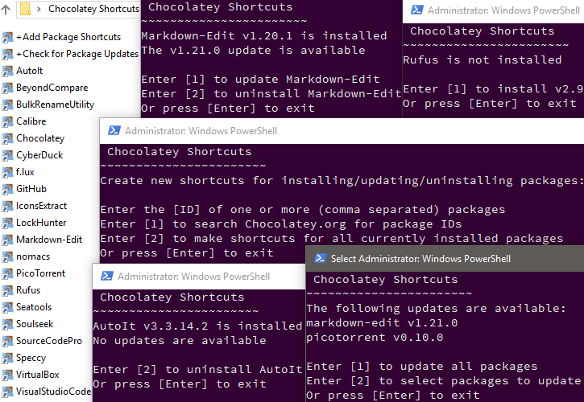

# Chocolatey Shortcuts 

Launch into various [Chocolatey](https://chocolatey.org/) package management tasks via file shortcuts and command line menus. 

Keep shortcuts for all your packages handy in a (portable) directory of your choice.

Think of it as a GUI of sorts, made of Windows shortcuts and PowerShell menus.

## Installation

Provided you have Chocolatey [installed](https://chocolatey.org/install), open PowerShell (as admin) and enter: 

<big>**`choco install ChocoShortcuts`**</big>

More info here: [chocolatey.org/packages/ChocoShortcuts](https://chocolatey.org/packages/ChocoShortcuts/)

## Usage

Upon installation, you'll find a "Chocolatey Shortcuts" folder on your desktop. You can rename or move the folder wherever you like, or keep it synced between computers in your Dropbox, OneDrive, etc. 

To create shortcuts for packages, use "+Add Package Shortcuts". You'll find options to generate shortcuts individually, in bulk, or for all currently installed packages. You can use the search function to find package IDs.

Upon launching package shortcuts, you'll have options to install (if not installed), update (if available), or uninstall the package.

Check all installed packages for updates using "+Check for Package Updates". There, you can update multiple packages at once.